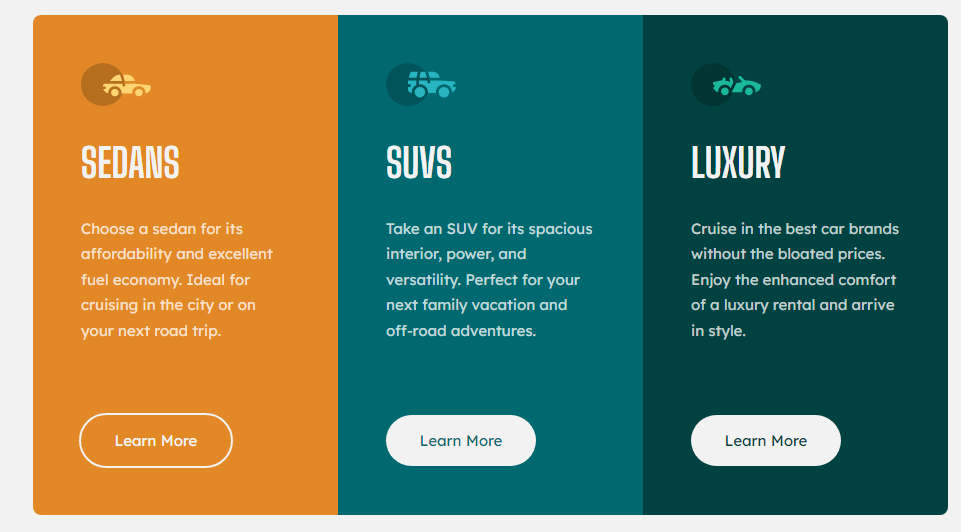
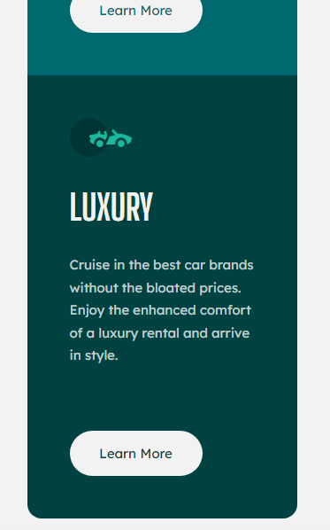

On my road to become a Front End Developer  🚀

# 3-column preview card component solution

This is a solution to the [3-column preview card component challenge on Frontend Mentor](https://www.frontendmentor.io/challenges/3column-preview-card-component-pH92eAR2-)

## Overview

### The challenge/ My process/ What I learned

In this simple challenge I just created a 3-column card component. I only used HTML and CSS. The component has a responsive behavior, which I created using the flex-wrap property and some media query's for the edges of the cards, which I think made the behavior a little more pleasant.

### Screenshot

- Live Site URL: [3-column preview card component by Rodrigo](https://your-live-site-url.com)

**Have fun building!** 🚀
